# Vue Router

## 前端路由阶段

- 前后端分离阶段：
随着Ajax的出现, 有了前后端分离的开发模式.
后端只提供API来返回数据, 前端通过Ajax获取数据, 并且可以通过JavaScript将数据渲染到页面中.
这样做最大的优点就是前后端责任的清晰, 后端专注于数据上, 前端专注于交互和可视化上.
并且当移动端(iOS/Android)出现后, 后端不需要进行任何处理, 依然使用之前的一套API即可.
目前很多的网站依然采用这种模式开发.

- 单页面富应用阶段:
其实SPA最主要的特点就是在前后端分离的基础上加了一层前端路由. 也就是前端来维护一套路由规则.
前端路由的核心是 **改变URL，但是页面不进行整体的刷新。**

## URL的hash

URL的hash也就是锚点(#), 本质上是改变`window.location`的`href`属性.
我们可以通过直接赋值`location.hash`来改变`href`, 但是页面不发生刷新

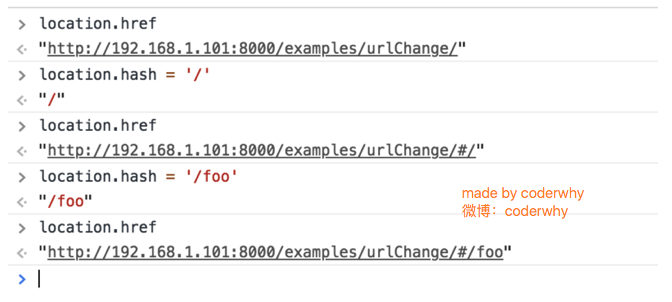

## HTML5的history模式

history接口是HTML5新增的, 它有五种模式改变URL而不刷新页面.
### `history.pushState()`

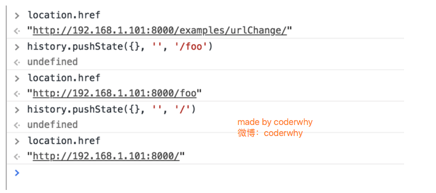

### `history.replaceState()`

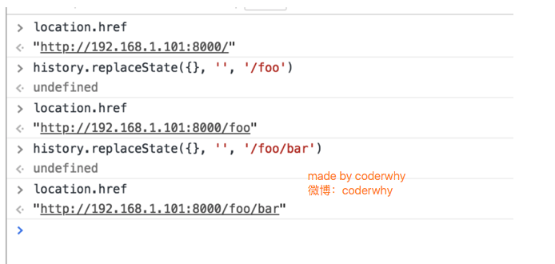

### `history.go()`

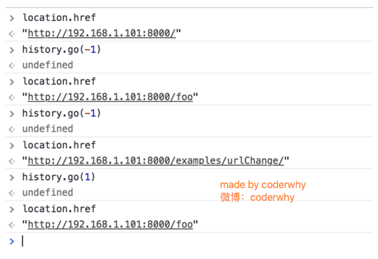    

上面只演示了三个方法
因为` history.back()` 等价于` history.go(-1)`
`history.forward()` 则等价于` history.go(1)`
这三个接口等同于浏览器界面的前进后退。


## 认识vue-router

目前前端流行的三大框架, 都有自己的路由实现:
> Angular的ngRouter
> React的ReactRouter
> Vue的vue-router

当然, 我们的重点是vue-router
vue-router是Vue.js官方的路由插件，它和vue.js是深度集成的，适合用于构建单页面应用。
我们可以访问其官方网站对其进行学习: https://router.vuejs.org/zh/
vue-router是基于**路由和组件的**
路由用于设定访问路径, **将路径和组件映射起来.**
在vue-router的单页面应用中, **页面的路径的改变就是组件的切换.**

## 安装和使用vue-router

### 安装vue-router

`npm install vue-router --save`


### 创建路由组件


### 挂载到Vue实例中


### 配置路由映射: 组件和路径映射关系


### 使用路由

通过`<router-link>`和`<router-view>`


`<router-link>:` 该标签是一个vue-router中已经内置的组件, 它会被渲染成一个`<a>`标签.
`<router-view>`: 该标签会根据当前的路径, 动态渲染出不同的组件.
网页的其他内容, 比如顶部的标题/导航, 或者底部的一些版权信息等会和`<router-view>`处于同一个等级.
在路由切换时, 切换的是`<router-view>`挂载的组件, 其他内容不会发生改变.

## 路由的默认路径

我们这里还有一个不太好的实现:
默认情况下, 进入网站的首页, 我们希望`<router-view>`渲染首页的内容.
但是我们的实现中, 默认没有显示首页组件, 必须让用户点击才可以.
如何可以让路径默认跳到到首页, 并且`<router-view>`渲染首页组件呢?
非常简单, 我们只需要配置多配置一个映射就可以了.
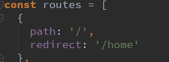
配置解析:
我们在`routes`中又配置了一个映射. 
`path`配置的是根路径: /
`redirect`是重定向, 也就是我们将根路径重定向到`/home`的路径下, 这样就可以得到我们想要的结果了.

## 使用 History 模式

默认情况下, 路径的改变使用的URL的hash.
如果希望使用HTML5的history模式, 非常简单, 进行如下配置即可:

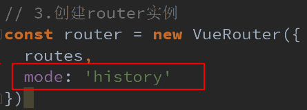

## router-link补充

在前面的`<router-link>`中, 我们只是使用了一个属性: to, 用于指定跳转的路径.
`<router-link>`还有一些其他属性:

- tag: tag可以指定`<router-link>`之后渲染成什么组件, 比如上面的代码会被渲染成一个`<li>`元素, 而不是`<a>`

- replace: replace不会留下history记录, 所以指定replace的情况下, 后退键返回不能返回到上一个页面中

- active-class: 当`<router-link>`对应的路由匹配成功时, 会自动给当前元素设置一个router-link-active的class, 设置active-class可以修改默认的名称.

在进行高亮显示的导航菜单或者底部tabbar时, 会使用到该类.
但是通常不会修改类的属性, 会直接使用默认的`router-link-active`即可. 

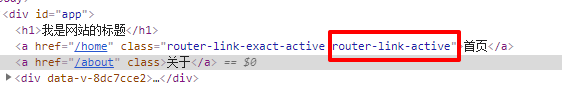

## 修改linkActiveClass

该class具体的名称也可以通过router实例的属性进行修改 


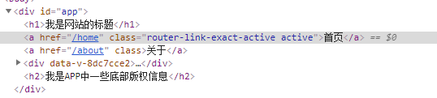

## 路由代码跳转

有时候, 页面的跳转可能需要执行对应的JavaScript代码, 这个时候, 就可以使用第二种跳转方式了


## 动态路由

在某些情况下，一个页面的path路径可能是不确定的，比如我们进入用户界面时，希望是如下的路径

- /user/aaaa或/user/bbbb
- 除了有前面的/user之外，后面还跟上了用户的ID

这种path和Component的匹配关系，我们称之为动态路由(也是路由传递数据的一种方式)。

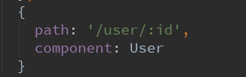

## 路由的懒加载

### 概念

官方给出了解释:
当打包构建应用时，Javascript 包会变得非常大，影响页面加载。
如果我们能把不同路由对应的组件分割成不同的代码块，然后当路由被访问的时候才加载对应组件，这样就更加高效了
官方在说什么呢?
首先, 我们知道路由中通常会定义很多不同的页面.
这个页面最后被打包在哪里呢? 一般情况下, 是放在一个js文件中.
但是, 页面这么多放在一个js文件中, 必然会造成这个页面非常的大.
如果我们一次性从服务器请求下来这个页面, 可能需要花费一定的时间, 甚至用户的电脑上还出现了短暂空白的情况.
如何避免这种情况呢? 使用路由懒加载就可以了.
路由懒加载做了什么?
路由懒加载的主要作用就是将路由对应的组件打包成一个个的js代码块.
只有在这个路由被访问到的时候, 才加载对应的组件

### 效果

没有使用懒加载
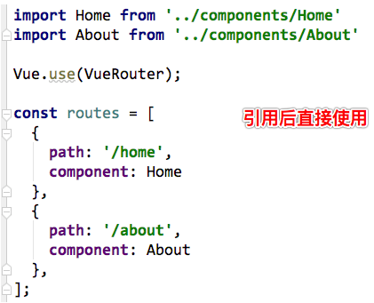 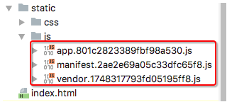

- 使用懒加载
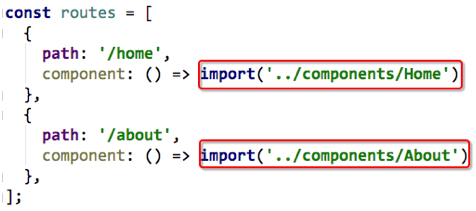 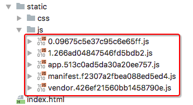

### 懒加载的写法

- 结合Vue的异步组件和Webpack的代码分析

```js
const Home = resolve => { require.ensure(['../components/Home.vue'], () => { resolve(require('../components/Home.vue')) })};
```

- AMD写法

```js
const About = resolve => require(['../components/About.vue'], resolve);
```

- ES6(最简洁)

```js
const Home = () => import('../components/Home.vue')
```

### 嵌套路由


## 传递参数

传递参数主要有两种类型: params和query

- params的类型:
配置路由格式: /router/:id
传递的方式: 在path后面跟上对应的值
传递后形成的路径: /router/123, /router/abc

- query的类型:
配置路由格式: /router, 也就是普通配置
传递的方式: 对象中使用query的key作为传递方式
传递后形成的路径: /router?id=123, /router?id=abc

### 使用方式

#### `<router-link>`方式


#### JavaScript代码方式


## 获取参数

获取参数通过$route对象获取的.
在使用了 vue-router 的应用中，路由对象会被注入每个组件中，赋值为 this.$route ，并且当路由切换时，路由对象会被更新。
通过$route获取传递的信息如下:


## $route和$router的区别

- $router为VueRouter实例，想要导航到不同URL，则使用$router.push方法

- $route为当前router跳转对象里面可以获取name、path、query、params等 


## 导航守卫
### 为什么使用导航守卫?

我们来考虑一个需求: 在一个SPA应用中, 如何改变网页的标题呢?
网页标题是通过`<title>`来显示的, 但是SPA只有一个固定的HTML, 切换不同的页面时, 标题并不会改变.
但是我们可以通过JavaScript来修改`<title>`的内容`.window.document.title = '新的标题'`.

那么在Vue项目中, 在哪里修改? 什么时候修改比较合适呢?

- 普通的修改方式:
我们比较容易想到的修改标题的位置是每一个路由对应的组件.vue文件中.
通过mounted声明周期函数, 执行对应的代码进行修改即可.
但是当页面比较多时, 这种方式不容易维护(因为需要在多个页面执行类似的代码).
有没有更好的办法呢? 使用导航守卫即可.

什么是导航守卫?

- vue-router提供的导航守卫主要用来监听监听路由的进入和离开的.
- vue-router提供了beforeEach和afterEach的钩子函数, 它们会在路由即将改变前和改变后触发

### 导航守卫使用

我们可以利用beforeEach来完成标题的修改.
首先, 我们可以在钩子当中定义一些标题, 可以利用meta来定义
其次, 利用导航守卫,修改我们的标题.


- 导航钩子的三个参数解析:
to: 即将要进入的目标的路由对象.
from: 当前导航即将要离开的路由对象.
next: 调用该方法后, 才能进入下一个钩子


如果是后置钩子, 也就是afterEach, 不需要主动调用next()函数
上面我们使用的导航守卫, 被称之为全局守卫.
此外还有 路由独享的守卫. 组件内的守卫.

更多内容, 可以查看[官网](https://router.vuejs.org/zh/guide/advanced/navigation-guards.html#%E8%B7%AF%E7%94%B1%E7%8B%AC%E4%BA%AB%E7%9A%84%E5%AE%88%E5%8D%AB)进行学习:


