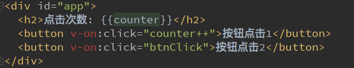
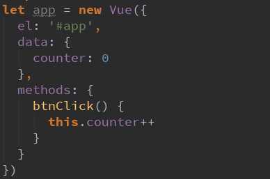
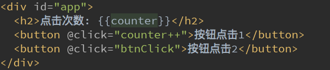
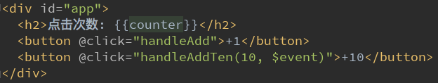
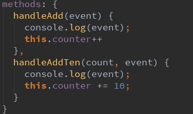
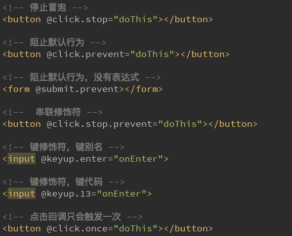

# Vue 事件监听

在前端开发中，我们需要经常和用于交互。 这个时候，我们就必须监听用户发生的时间，比如点击、拖拽、键盘事件等等
在Vue中如何监听事件呢？使用v-on指令

## v-on 介绍

作用：绑定事件监听器
缩写：@
预期：Function | Inline Statement | Object
参数：event

## v-on 基础
我们用一个监听按钮的点击事件，来简单看看v-on的使用
下面的代码中，我们使用了v-on:click="counter++”
另外，我们可以将事件指向一个在methods中定义的函数

## v-on 的语法糖：

v-on:click可以写成@click

## v-on 参数

当通过methods中定义方法，以供@click调用时，需要**注意参数问题**：
- 情况一：如果该方法不需要额外参数，那么方法后的()可以不添加。
   但是注意：如果方法本身中有一个参数，那么会**默认将原生事件event参数传递进去**
- 情况二：如果需要同时传入某个参数，同时需要event时，可以通过$event传入事件。

## v-on 修饰符

在某些情况下，我们拿到event的目的可能是进行一些事件处理。
Vue提供了修饰符来帮助我们方便的处理一些事件：
- .stop - 调用 event.stopPropagation()。
- .prevent - 调用 event.preventDefault()。
- .{keyCode | keyAlias} - 只当事件是从特定键触发时才触发回调。
- .native - 监听组件根元素的原生事件。
- .once - 只触发一次回调。

