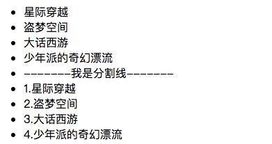
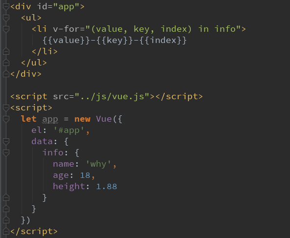
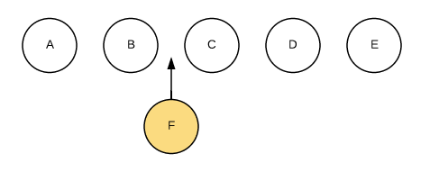

# Vue 循环遍历

## v-for遍历数组

当我们有一组数据需要进行渲染时，我们就可以使用v-for来完成。
v-for的语法类似于JavaScript中的for循环。
格式如下：`item in items` 的形式。

- 案例：

如果在遍历的过程中不需要使用索引值
```js
v-for="movie in movies"
```
依次从movies中取出movie，并且在元素的内容中，我们可以使用Mustache语法，来使用movie
如果在遍历的过程中，我们需要拿到元素在数组中的索引值呢？
```js
v-for=(item, index) in items
```
其中的index就代表了取出的item在原数组的索引值。




## v-for遍历对象

比如某个对象中存储着你的个人信息，我们希望以列表的形式显示出来。


## 组件的key属性

官方推荐我们在使用 v-for 时，给对应的元素或组件添加上一个:key属性。
为什么需要这个key属性呢？ 这个其实和Vue的虚拟DOM的Diff算法有关系。


当某一层有很多相同的节点时，也就是列表节点时，我们希望插入一个新的节点
我们希望可以在B和C之间加一个F，Diff算法默认执行起来是这样的。
即把C更新成F，D更新成C，E更新成D，最后再插入E，是不是很没有效率？
所以我们需要使用key来给每个节点做一个唯一标识
Diff算法就可以正确的识别此节点 找到正确的位置区插入新的节点。
所以一句话，**key的作用主要是为了高效的更新虚拟DOM**
