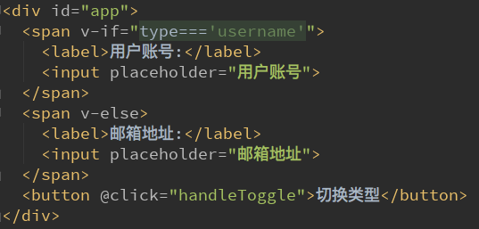
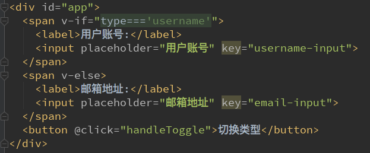

# Vue 条件判断

v-if、v-else-if、v-else
这三个指令与JavaScript的条件语句if、else、else if类似。
Vue的条件指令可以根据表达式的值在DOM中渲染或销毁元素或组件

简单的案例演示：

## v-if的原理

v-if后面的条件为false时，对应的元素以及其子元素不会渲染。 也就是根本没有不会有对应的标签出现在DOM中。

## 条件渲染案例
我们来做一个简单的小案例：
用户再登录时，可以切换使用用户账号登录还是邮箱地址登录。
类似如下情景：

 

### 小问题(key 的作用)
如果我们在有输入内容的情况下，切换了类型，我们会发现文字依然显示之前的输入的内容。
但是按道理讲，我们应该切换到另外一个input元素中了。
在另一个input元素中，我们并没有输入内容。
为什么会出现这个问题呢？
- 问题解答：
这是因为Vue在进行DOM渲染时，出于性能考虑，会尽可能的复用已经存在的元素，而不是重新创建新的元素。
在上面的案例中，Vue内部会发现原来的input元素不再使用，直接作为else中的input来使用了。
- 解决方案：
如果我们不希望Vue出现类似重复利用的问题，可以给对应的input添加key
并且我们需要保证key的不同

## v-show

> v-show的用法和v-if非常相似，也用于决定一个元素是否渲染：

v-if和v-show都可以决定一个元素是否渲染，那么开发中我们如何选择呢？
- v-if当条件为false时，压根不会有对应的元素在DOM中。
- v-show当条件为false时，仅仅是将元素的display属性设置为none而已。
开发中如何选择呢？
**当需要在显示与隐藏之间切片很频繁时，使用v-show**
**当只有一次切换时，通过使用v-if**
