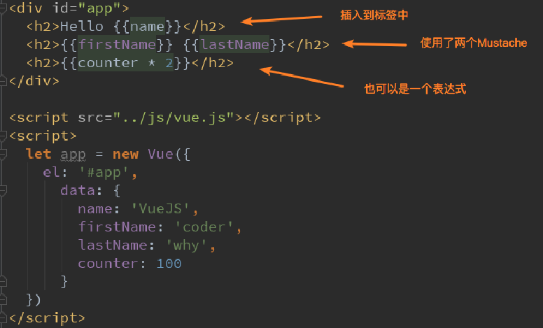
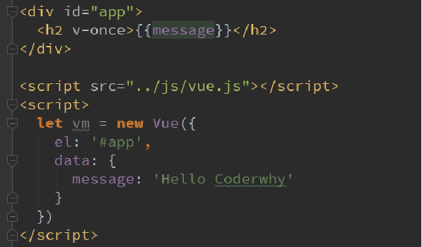
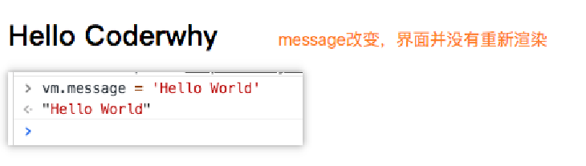
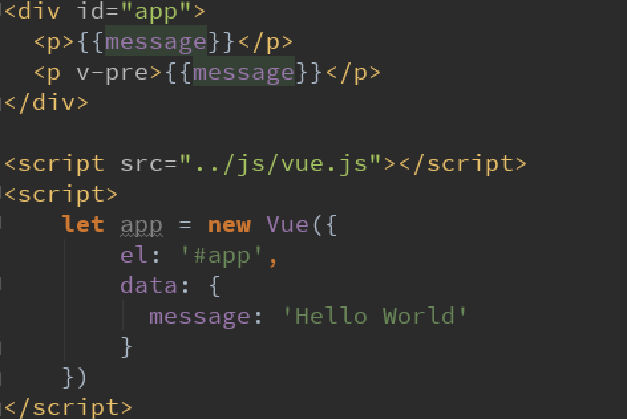

# Vue 模板语法

## Mustache

可以通过Mustache语法(也就是双大括号)。将data中的文本数据插入到HTML中
Mustache: 胡子/胡须.
我们可以像下面这样来使用，并且数据是响应式的



## v-once

在某些情况下，我们可能不希望界面随意的跟随改变，这个时候，我们就可以使用一个Vue的指令
v-once: 
该指令后面不需要跟任何表达式
该指令表示元素和组件(组件后面才会学习)只渲染一次，不会随着数据的改变而改变。

代码如下：



## v-html

某些情况下，我们从服务器请求到的数据本身就是一个HTML代码
如果我们直接通过{{}}来输出，会将HTML代码也一起输出。
但是我们可能希望的是按照HTML格式进行解析，并且显示对应的内容。
如果我们希望解析出HTML展示
可以使用v-html指令
该指令后面往往会跟上一个string类型
会将string的html解析出来并且进行渲染


## v-text
v-text作用和Mustache比较相似：都是用于将数据显示在界面中
v-text通常情况下，接受一个string类型


## v-pre

v-pre用于跳过这个元素和它子元素的编译过程，用于显示原本的Mustache语法。
比如下面的代码：
第一个h2元素中的内容会被编译解析出来对应的内容
第二个h2元素中会直接显示{{message}}



## v-cloak

在某些情况下，我们浏览器可能会直接显然出未编译的Mustache标签。
cloak: 斗篷


## v-bind介绍

前面的指令主要作用是将值插入到我们模板的内容当中。 但是，除了内容需要动态来决定外，某些属性我们也希望动态来绑定。 
- 比如动态绑定a元素的href属性
- 比如动态绑定img元素的src属性
这个时候，我们可以使用v-bind指令：
作用：动态绑定属性
预期：any (with argument) | Object (without argument)
参数：attrOrProp (optional)
下面，我们就具体来学习v-bind的使用。

v-bind用于绑定一个或多个属性值，或者向另一个组件传递props值(这个学到组件时再介绍) 在开发中，有哪些属性需要动态进行绑定呢？
- 比如图片的链接src、网站的链接href、动态绑定一些类、样式等等
- 比如通过Vue实例中的data绑定元素的src和href，代码如下：


### v-bind语法糖

v-bind有一个对应的语法糖，也就是简写方式
在开发中，我们通常会使用语法糖的形式，因为这样更加简洁。
简写方式如下


### v-bind绑定class

很多时候，我们希望动态的来切换class，比如：
- 当数据为某个状态时，字体显示红色。
- 当数据另一个状态时，字体显示黑色。
绑定class有两种方式：
- 对象语法
- 数组语法

#### 对象语法
绑定方式：对象语法
对象语法的含义是:class后面跟的是一个对象。
对象语法有下面这些用法：

- 用法一：直接通过{}绑定一个类

```html
<h2 :class="{'active': isActive}">Hello World</h2>
```

- 用法二：也可以通过判断，传入多个值

```html
<h2 :class="{'active': isActive, 'line': isLine}">Hello World</h2>
```

- 用法三：和普通的类同时存在，并不冲突  注：如果isActive和isLine都为true，那么会有title/active/line三个类

```html
<h2 class="title" :class="{'active': isActive, 'line': isLine}">Hello World</h2>
```

- 用法四：如果过于复杂，可以放在一个methods或者computed中  注：classes是一个计算属性

```html
<h2 class="title" :class="classes">Hello World</h2>
```

#### 数组语法

绑定方式：数组语法
数组语法的含义是:class后面跟的是一个数组。
数组语法有下面这些用法：

- 用法一：直接通过{}绑定一个类

```html
<h2 :class="['active']">Hello World</h2>
```

- 用法二：也可以传入多个值

```html
<h2 :class=“[‘active’, 'line']">Hello World</h2>
```

- 用法三：和普通的类同时存在，并不冲突  注：会有title/active/line三个类

```html
<h2 class="title" :class=“[‘active’, 'line']">Hello World</h2>
```

- 用法四：如果过于复杂，可以放在一个methods或者computed中  注：classes是一个计算属性

```html
<h2 class="title" :class="classes">Hello World</h2>
```


### v-bind绑定style

- 对象语法

`:style="{color: currentColor, fontSize: fontSize + 'px'}"`
style后面跟的是一个对象类型
对象的key是CSS属性名称
对象的value是具体赋的值，值可以来自于data中的属性

- 数组语法

`<div v-bind:style="[baseStyles, overridingStyles]"></div>`
style后面跟的是一个数组类型  多个值以，分割即可