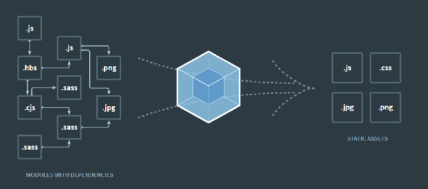
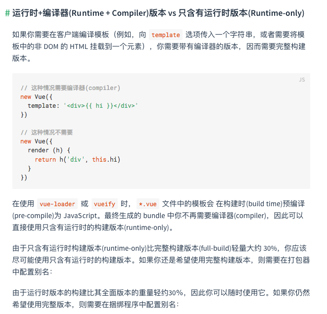
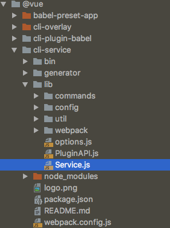

### 什么是Vue CLI

- 如果你只是简单写几个Vue的Demo程序, 那么你不需要Vue CLI
- 如果你在开发大型项目, 那么你需要, 并且必然需要使用Vue CLI
- 使用Vue.js开发大型应用时，我们需要考虑代码目录结构、项目结构和部署、热加载、代码单元测试等事情。
- 如果每个项目都要手动完成这些工作，那无以效率比较低效，所以通常我们会使用一些脚手架工具来帮助完成这些事情。

**CLI是什么意思?**

- CLI是Command-Line Interface, 翻译为命令行界面, 但是俗称脚手架.
- Vue CLI是一个官方发布 vue.js 项目脚手架
- 使用 vue-cli 可以快速搭建Vue开发环境以及对应的webpack配置.

### 使用 CLI 的前提

#### node npm 安装
去官网下载即可

- NPM的全称是Node Package Manager
- 是一个NodeJS包管理和分发工具，已经成为了非官方的发布Node模块（包）的标准。
- 后续我们会经常使用NPM来安装一些开发过程中依赖包.

#### npm 更改国内源

```shell
npm config set registry https://registry.npm.taobao.org
```

#### webpack 安装

```shell
# 全局安装
npm install webpack -g
```
- 对所有的资源会压缩等优化操作
- 它在开发过程中提供了一套完整的功能，能够使得我们开发过程中变得高效。



### 安装vue脚手架

- Vue CLI3版本的安装

```shell
 npm install -g @vue/cli
```

- Vue CLI2 版本的安装

```shell
 npm install -g @vue/cli-init
```

### 初始化项目

- CLI 3 版本
```shell
vue create my-project
```

- CLI 2 版本

```shell
vue init webpack my-project
```
G
### Runtime-Compiler和Runtime-only的区别


**简单总结**

- 如果在之后的开发中，你依然使用template，就需要选择Runtime-Compiler
- 如果你之后的开发中，使用的是.vue文件夹开发，那么可以选择Runtime-only



### 自定义配置

UI方面的配置  启动配置服务器：vue ui


CLI3 版本省略很多配置，但是这些配置并不是去掉了，而是隐藏起来了，我们可以根据需要自定义配置

被隐藏的配置的目录：


自定义配置

