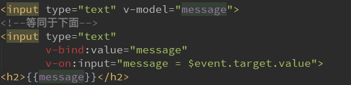
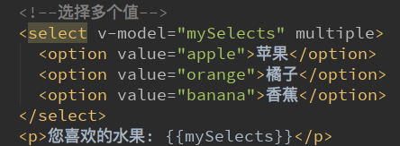

# Vue 表单绑定 V-model 的使用

## 表单绑定v-model

表单控件在实际开发中是非常常见的。特别是对于用户信息的提交，需要大量的表单。
Vue中使用v-model指令来实现表单元素和数据的双向绑定。


- 案例的解析：
当我们在输入框输入内容时
因为input中的v-model绑定了message，所以会实时将输入的内容传递给message，message发生改变。
当message发生改变时，因为上面我们使用Mustache语法，将message的值插入到DOM中，所以DOM会发生响应的改变。
所以，通过v-model实现了双向的绑定。
当然，我们也可以将v-model用于textarea元素


## v-model原理

v-model其实是一个语法糖，它的背后本质上是包含两个操作：
- 1.v-bind绑定一个value属性
- 2.v-on指令给当前元素绑定input事件

也就是说下面的代码：等同于下面的代码：

```html
<input type="text" v-model="message">
<!-- 等同于-->
<input type="text" v-bind:value="message" v-on:input="message = $event.target.value">
```



## v-model：radio(单选框)
当存在多个单选框时


## v-model：checkbox(复选框)

复选框分为两种情况：单个勾选框和多个勾选框
- 单个勾选框：
v-model即为布尔值。
此时input的value并不影响v-model的值。


- 多个复选框：
当是多个复选框时，因为可以选中多个，所以对应的data中属性是一个数组。
当选中某一个时，就会将input的value添加到数组中。


## v-model：select

和checkbox一样，select也分单选和多选两种情况。
- 单选：只能选中一个值。
v-model绑定的是一个值。
当我们选中option中的一个时，会将它对应的value赋值到mySelect中

- 多选：可以选中多个值。
v-model绑定的是一个数组。
当选中多个值时，就会将选中的option对应的value添加到数组mySelects中

 


## 修饰符

- lazy修饰符：
默认情况下，v-model默认是在input事件中同步输入框的数据的。
也就是说，一旦有数据发生改变对应的data中的数据就会自动发生改变。
lazy修饰符可以让数据在失去焦点或者回车时才会更新：

- number修饰符：
默认情况下，在输入框中无论我们输入的是字母还是数字，都会被当做字符串类型进行处理。
但是如果我们希望处理的是数字类型，那么最好直接将内容当做数字处理。
number修饰符可以让在输入框中输入的内容自动转成数字类型：

- trim修饰符：
如果输入的内容首尾有很多空格，通常我们希望将其去除
trim修饰符可以过滤内容左右两边的空格


