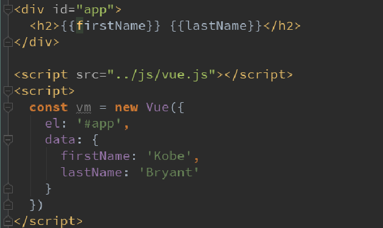
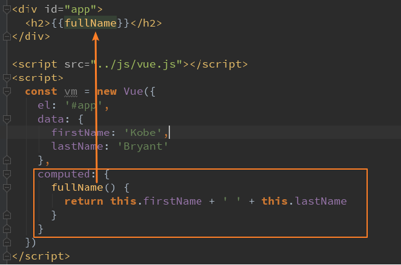
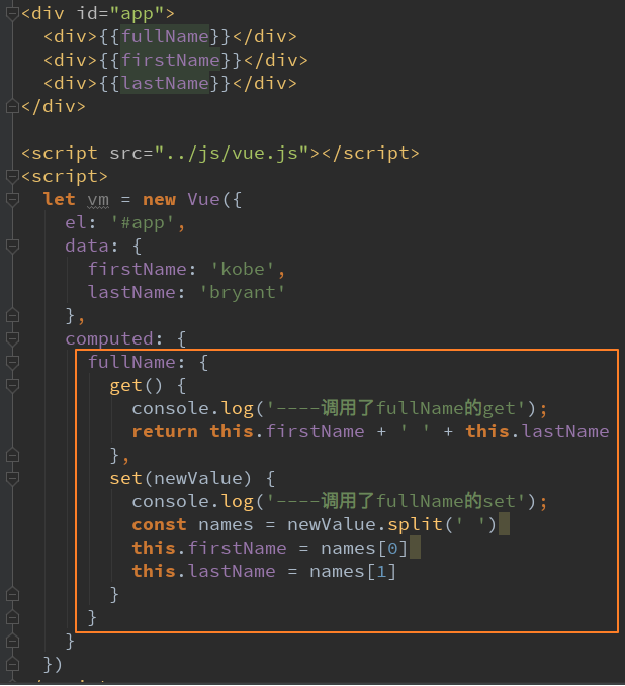
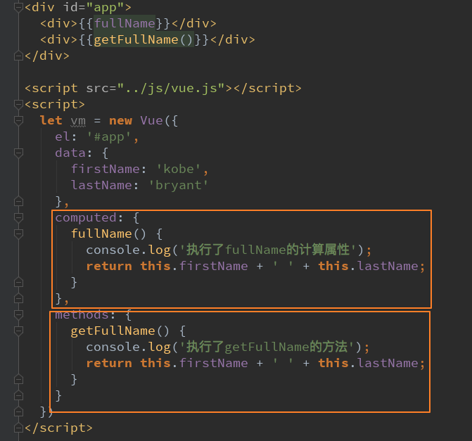
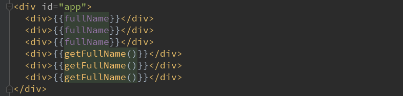

# Vue 计算属性

## 什么是计算属性

在模板中可以直接通过插值语法显示一些data中的数据。
但是在某些情况，我们可能需要对数据进行一些转化后再显示，或者需要将多个数据结合起来进行显示
比如我们有firstName和lastName两个变量，我们需要显示完整的名称。
但是如果多个地方都需要显示完整的名称，我们就需要写多个`{{firstName}} {{lastName}}`
我们可以将上面的代码换成计算属性：
OK，我们发现计算属性是写在实例的computed选项中的

## 计算属性的setter和getter

每个计算属性都包含一个getter和一个setter
在上面的例子中，我们只是使用getter来读取。
在某些情况下，你也可以提供一个setter方法（不常用）。
在需要写setter的时候，代码如下：

## 计算属性的缓存

我们可能会考虑这样的一个问题：
methods和computed看起来都可以实现我们的功能，
那么为什么还要多一个计算属性这个东西呢？
原因：计算属性会进行缓存，如果多次使用时，计算属性只会调用一次。
我们来看下面的代码：

