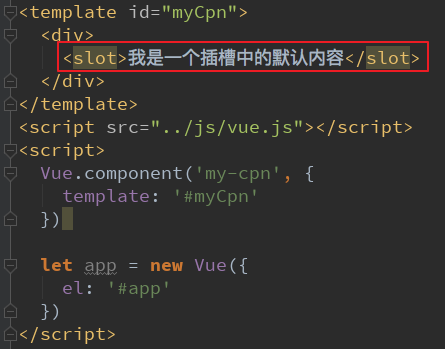
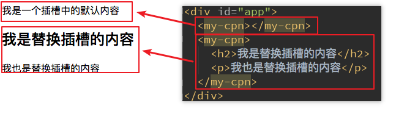
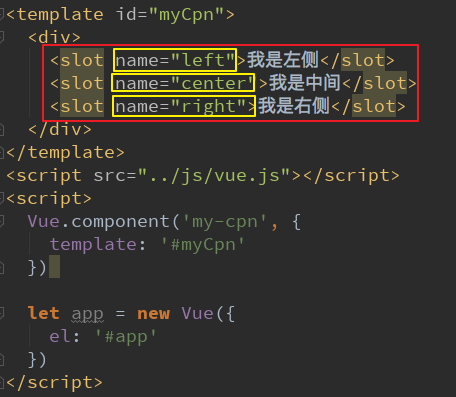
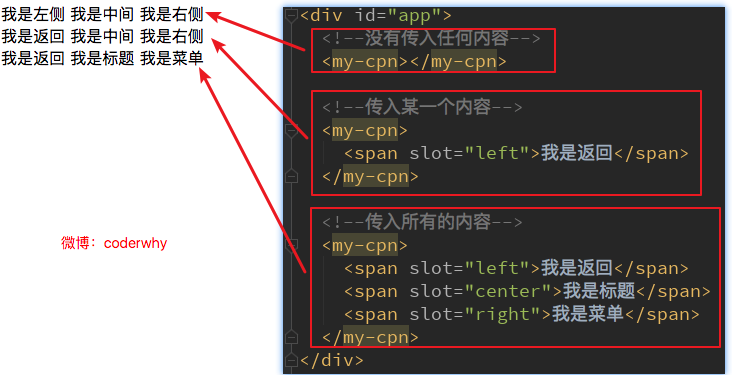
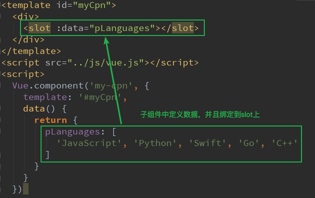

# 插槽slot的使用

## slot基本使用

在子组件中，使用特殊的元素`<slot>`就可以为子组件开启一个插槽。
该插槽插入什么内容取决于父组件如何使用。

我们通过一个简单的例子，来给子组件定义一个插槽：
`<slot>`中的内容表示，如果没有在该组件中插入任何其他内容，就默认显示该内容
有了这个插槽后，父组件如何使用呢？

##   具名插槽slot

当子组件的功能复杂时，子组件的插槽可能并非是一个。
比如我们封装一个导航栏的子组件，可能就需要三个插槽，分别代表左边、中间、右边。
那么，外面在给插槽插入内容时，如何区分插入的是哪一个呢？
这个时候，我们就需要给插槽起一个名字
如何使用具名插槽呢？
非常简单，只要给slot元素一个name属性即可
`<slot name='myslot'></slot>`
我们来给出一个案例：
这里我们先不对导航组件做非常复杂的封装，先了解具名插槽的用法。

## 作用域插槽

父组件替换插槽的标签，但是内容由子组件来提供。
其实就是  **如何在父组件中拿到子组件数据的问题**

我们先提一个需求：
子组件中包括一组数据，比如：`pLanguages: ['JavaScript', 'Python', 'Swift', 'Go', 'C++']`
需要在多个界面进行展示：
某些界面是以水平方向一一展示的，
某些界面是以列表形式展示的，
某些界面直接展示一个数组

内容在子组件，希望父组件告诉我们如何展示，怎么办呢？
利用slot作用域插槽就可以了
我们来看看子组件的定义：

在父组件使用我们的子组件时，从子组件中拿到数据：
我们通过`<template slot-scope="slotProps">`获取到`slotProps`属性
在通过`slotProps.data`就可以获取到刚才我们传入的data了

