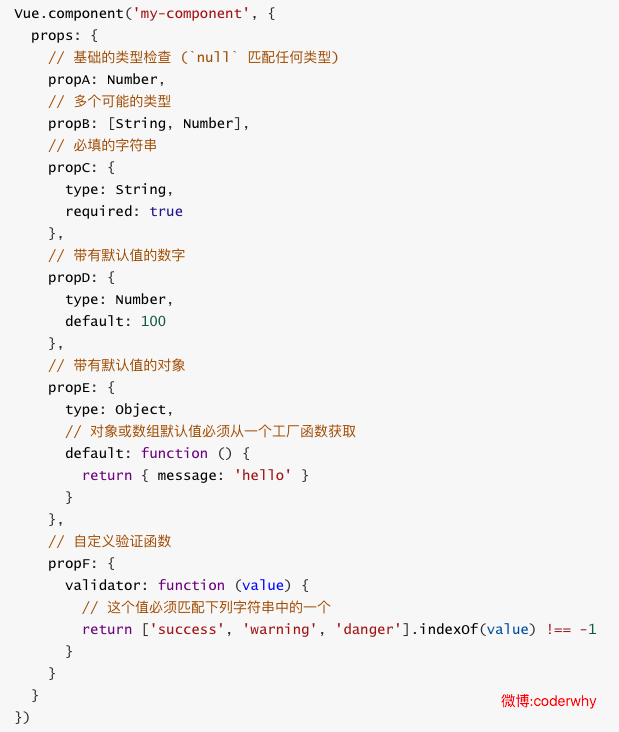

# 父子组件传递数据（props）

在组件中，使用选项props来声明需要从父级接收到的数据

## props基本用法

props的值有两种方式：
- 方式一：字符串数组，数组中的字符串就是传递时的名称。

- 方式二：对象，对象可以设置传递时的类型，也可以设置默认值等。

一个最简单的props传递：


## props数据验证

在前面，我们的props选项是使用一个数组。
我们说过，除了数组之外，我们也可以使用对象，当需要对props进行类型等验证时，就需要对象写法了。
验证都支持数据类型有
```js
String
Number
Boolean
Array
Object
Date
Function
Symbol
```

当我们有自定义构造函数时，验证也支持自定义的类型
例子：


# 子级向父级传递

props用于父组件向子组件传递数据，还有一种比较常见的是子组件传递数据或事件到父组件中。 这个时候，我们需要使用自定义事件来完成。

什么时候需要自定义事件呢？
当子组件需要向父组件传递数据时，就要用到自定义事件了。

我们之前学习的v-on不仅仅可以用于监听DOM事件，也可以用于组件间的自定义事件。

自定义事件的流程：
1. 在子组件中，通过$emit()来触发事件。
2. 在父组件中，通过v-on来监听子组件事件。

我们来看一个简单的例子：
我们之前做过一个两个按钮+1和-1，点击后修改counter。
我们整个操作的过程还是在子组件中完成，但是之后的展示交给父组件。
这样，我们就需要将子组件中的counter，传给父组件的某个属性，比如total。


