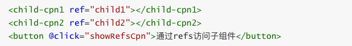

# 父子组件的访问

有时候我们需要父组件直接访问子组件，子组件直接访问父组件，或者是子组件访问跟组件。
- 父组件访问子组件：使用$children或$refs
- 子组件访问父组件：使用$parent

## $children

我们先来看下$children的访问

this.$children是一个数组类型，它包含所有子组件对象。
我们这里通过一个遍历，取出所有子组件的message状态。

## $ref
$children的缺陷：
通过$children访问子组件时，是一个数组类型，访问其中的子组件必须通过索引值。
但是当子组件过多，我们需要拿到其中一个时，往往不能确定它的索引值，甚至还可能会发生变化。
有时候，我们想明确获取其中一个特定的组件，这个时候就可以使用$refs

$refs的使用：
$refs和ref指令通常是一起使用的。
- 首先，我们通过ref给某一个子组件绑定一个特定的ID。
- 其次，通过this.$refs.ID就可以访问到该组件了。

## $parent

如果我们想在子组件中直接访问父组件，可以通过$parent
注意事项：
尽管在Vue开发中，我们允许通过$parent来访问父组件，但是在真实开发中尽量不要这样做。
子组件应该尽量避免直接访问父组件的数据，因为这样**耦合度太高了**。

如果我们将子组件放在另外一个组件之内，很可能该父组件没有对应的属性，往往会引起问题。
另外，更不好做的是通过$parent直接修改父组件的状态，那么父组件中的状态将变得飘忽不定，很不利于我的调试和维护。

## 编译作用域

官方对于编译的作用域解析比较简单，我们自己来通过一个例子来理解这个概念：
我们来考虑下面的代码是否最终是可以渲染出来的：
`<my-cpn v-show="isShow"></my-cpn>`中，我们使用了isShow属性。
isShow属性包含在组件中，也包含在Vue实例中。
答案：最终可以渲染出来，也就是使用的是Vue实例的属性。
为什么呢？
官方给出了一条准则：父组件模板的所有东西都会在父级作用域内编译；子组件模板的所有东西都会在子级作用域内编译。

而我们在使用`<my-cpn v-show="isShow"></my-cpn>`的时候，整个组件的使用过程是相当于在父组件中出现的。
那么他的作用域就是父组件，使用的属性也是属于父组件的属性。
因此，isShow使用的是Vue实例中的属性，而不是子组件的属性。

