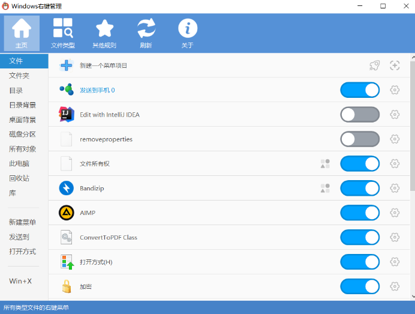
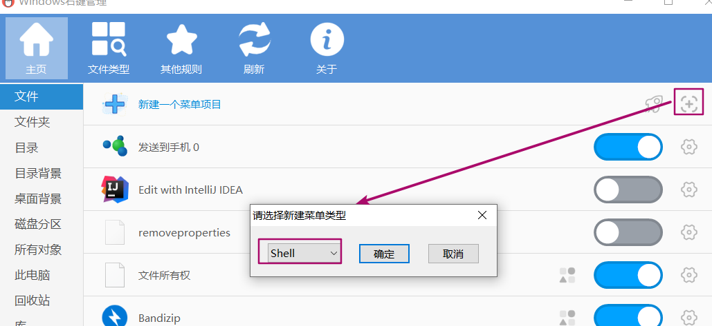
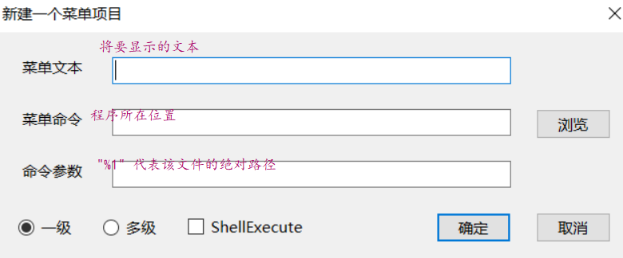
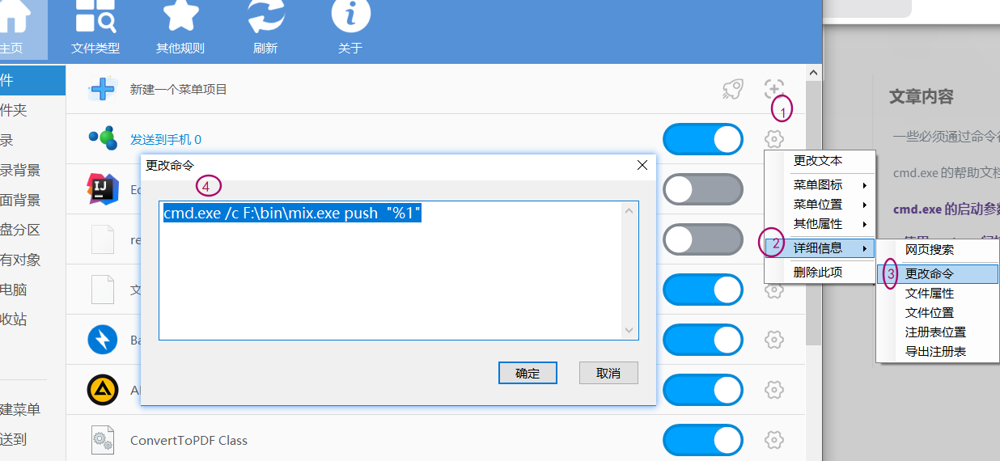
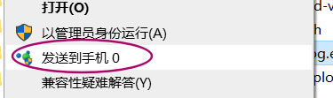

想把自己写的一个控制台程序添加到右键，可以通过修改注册表的方式实现，但是修改起来比较麻烦，推荐使用右键管理器进行修改



右侧的 ”文件“ ”文件夹“ ”目录“ 等，代表在该项右键时，右键菜单显示的内容

点击 + 新建：




点击确定



由于是控制台程序不能直接运行，需要作为cmd.exe 参数来启动，如下:

```txt
cmd.exe /c F:\bin\mix.exe push
```

另外，间接启动一个程序的时候也可以传入 /k 参数。与 /c 参数不同的是：

/c 在执行完程序之后，cmd.exe 也会终止
/k 在执行完程序之后，cmd.exe 依然会继续运行
所以 /c 命令会更适用于自动化的脚本，而 /k 命令则更适用于半自动化的脚本。

创建成功后可以修改命令以图标：




效果：

