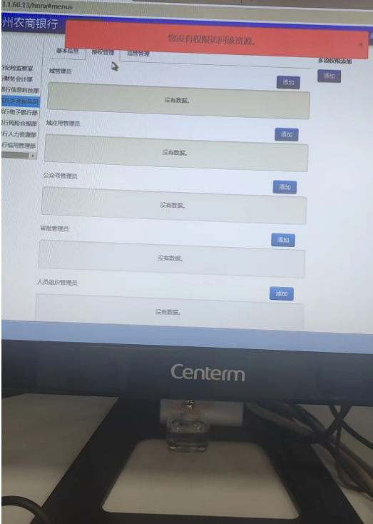

# 需求

1. ~~用户导入慢~~ 【已完成】
2. ~~机构导入~~，部门调整时关系错乱 【已完成】
3. ~~机构导入过慢问题~~ 【已完成】

4. 资源突然没有权限问题 【未开始】
   

5. 添加人员为空的部门禁用 【进行中】

## 部门禁用

### 禁用部门以及联动

#### 1. 部门禁用

1. 添加部门禁用字段，数据库添加字段后，切记要更新缓存
2. 禁用部门时，先检查部门以及所有子部门下是否有人。如果有人则不能禁用
3. 更新部门禁用字段，更新缓存

#### 2. 退出所有白名单

1. 搞清楚白名单的业务逻辑
2. 梳理清楚白名单增删查改的时机
3. 梳理清楚删除部门的白名单会影响哪些功能
4. 查找现有代码中部门退出白名单的逻辑，尽量复用那些已经使用最多的代码块

#### 3. 退出所有工作圈子

1. 梳理清楚部门和圈子的关系以及存储模型
2. 梳理部门加入或离开圈子的时机
3. 部门退出圈子的影响
4. 复用代码

#### 4. 取消公众号订阅

1. 梳理清楚公众号和部门的之间的关系以及存储模型
2. 部门和订阅之间的关系
3. 明确影响范围
4. 复用代码

#### 5. 删除应用的可见权限

1. 应用是啥
2. 可见权限又是啥
3. 他们和部门之间的关系是啥
4. 如何删除应用的可见权限
5. 影响范围

### 禁用部门之后对该部门自身的影响
TODO

### 查找禁用部门入口
TODO
### 禁用部门之后返回给端上的的数据变动
TODO

# 日报

- 2023-06-06 部门导入导致的部门编码错乱修复
  原因：
    组织机构层级调整必然导致部门编码发生错乱，但是没有修复动作
  修复方法：
    记录所有发生层级变化的部门，然后仅修复这些部门的编码
    由于引入了部门编码修复的逻辑，会导致执行时间变长，该时间和调整之后部门所辖的所有子部门数量有关

- 2023-06-07 部门导入慢优化
  改动逻辑： 
  1. 空间换时间，减少不必要的查询，可节省80%，优化效果明显 
  2. 减少不必要的数据库更新。以前时全量更新子部门数量，现仅更新发生变化的

- 2023-06-08 梳理部门禁用需求文档,评估影响范围
  改动多，涉及广。级联功能变动点多

- 2023-06-09 从代码逻辑层面梳理，评估难易程度
  代码复杂，逻辑晦涩难懂。暂时没有清晰的头绪，先拆分，逐个模块看吧

- 2023-06-12 部门禁用模块细化
  按照从整体到局部的逻辑拆分,越细越好

# 待查明的问题

~~生产ruby~~ 版本 【已完成】

~~开发分支规范~~： 1. 命令  2. 合并 【已完成】

# 账号密码备忘
wifi: pbcti202303

### 网络接入
11.1.215.157
账号 gs_姓名全拼
密码 Kfcs@123

### 数据库
11.1.196.238 
esns minxing123
SID: orcl
