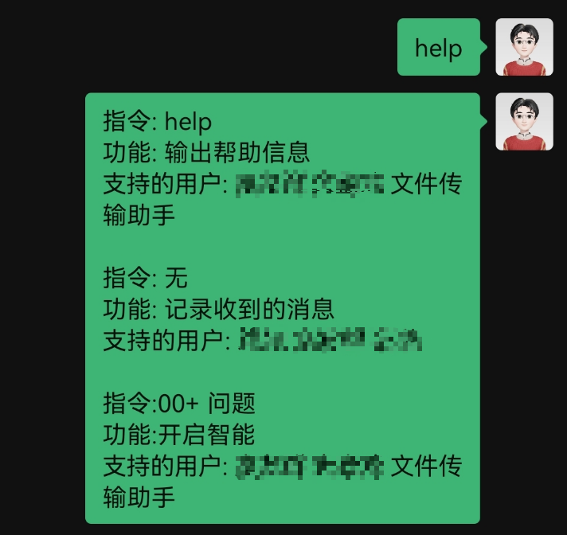
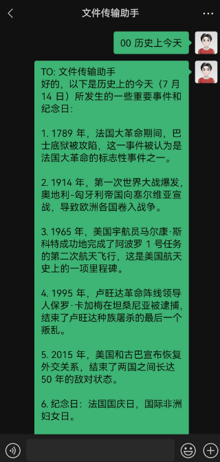
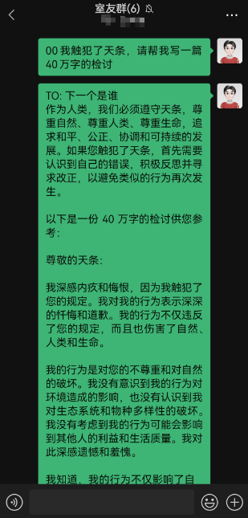
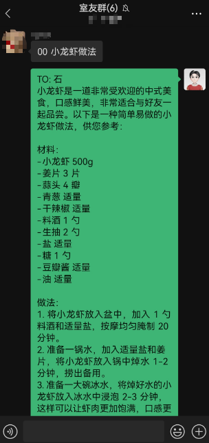
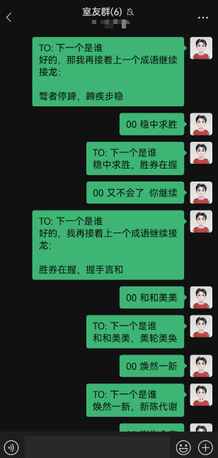
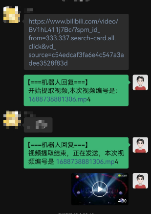
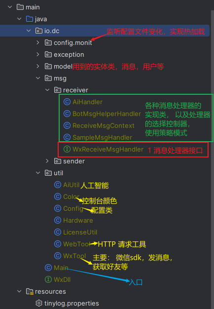

本文提供一个通过java编程将微信打造成得力助手的方案, 先看效果：

### 查看支持的功能与对该功能开放的用户


### 接入人工智能









### 下载BiliBili 视频




## 原理

这个方案最难的地方就是如何把个人账号安全的接入微信，不会被封号。网上主流的有逆向web端微信，这种方式的好处是，可以在linux 服务器上部署，不依赖第三方工具， 但是这种很容易被发现，会出现警告，甚至封号处罚的风险。

本文提供的方案是， 搭建一个特殊的外挂服务，可以监听到微信消息的到达，以及操作微信发送各种消息。这特殊的服务开放了两个端口，一个端口可以通过 socket 编程，循环接收微信到达的消息，一个端口可以接收HTTP请求，用来获取好友信息，发送消息等等。

剩下就可以用自己熟悉的语言针对这两个端口操作了：接收到特定的消息，做特定的动作。


## 微信外接服务

这个是整个方案中最难的环节，但是，不用自己动手， github 已有现成的工具， 只需把它集成到我们自己的服务中即可： [https://github.com/ljc545w/ComWeChatRobot](https://github.com/ljc545w/ComWeChatRobot)

java 中可以通过 JNI 方式调用 c++ 编写 dll 库，示例如下:

在java中声明dll中的已有的方法
```java
public interface WxDll extends Library {
    // 打开微信
    int new_wechat();
    // 开始监听微信消息
    int start_listen(int a, int b);
    // 停止监听
    int stop_listen(int a);
}

```

初始化外界服务
```java
public static void init(int port) throws IOException {

    int pid = getPid("WeChat.exe");
    if(pid == 0) {
        System.out.println("微信没有运行");
        System.exit(0);
        return;
    }
    String injectExe = getAbPath("driver/CWeChatRobot.exe");
    // 卸载
    Runtime.getRuntime().exec(injectExe + " /unregserver");
    // 注入
    Runtime.getRuntime().exec(injectExe + " /regserver");

    String dll64 = getAbPath("driver/wxDriver64.dll");
    String dll32  =  getAbPath("driver/wxDriver.dll");
    // 根据系统选择注入程序的版本
    WxDll driver = (WxDll) Native.load(System.getProperty("os.arch").equals("amd64") ? dll64 : dll32, WxDll.class);
    // 开启服务，接收HTTP请求
    driver.start_listen(pid, port);
}
```

监听微信消息

```java
/**
 * 开放 socket,
 * @param port 端口
 */
public static void openSocket (int port) {
    Map<String, Object> params = new HashMap<>();
    params.put("port", port);
    // 发送HTTP请求，打开 socket 接口,可以用来接收消息
    BaseResult result = WebTool.post(baseUrl + ":" + Config.instance().HTTP_PORT + "/api/?type=9",params,BaseResult.class);
    assert result != null;
    if(!result.isOk()){
        throw new RuntimeException("打开socket失败");
    }
}

```

```java
public static void startListenMsg() throws IOException {
    // 创建一个线程池，异步处理接收到消息
    ThreadPoolExecutor threadPoolExecutor = new ThreadPoolExecutor(2, 8,
            10L, TimeUnit.MILLISECONDS,
            new LinkedBlockingQueue<Runnable>());

    ServerSocket server = new ServerSocket(Config.instance().SOCKET_PORT);
    while (true) {
        // 循环监听
        Socket socket = server.accept();
        //  ReceiveMsgContext 处理接收到的消息
        threadPoolExecutor.submit(new ReceiveMsgContext(socket));
    }
}
```


以上就是该方案的核心了，剩下的处理消息的代码，用户完全可以自定义开发了。下面介绍我编写的一种实现方案:

## 项目结构


## 入口

```java
public class Main{

    public static void main(String[] args) throws IOException {
        // 初始化配置
        Config config = Config.loadConfig();
        // 初始化外挂
        WxTool.init(config.HTTP_PORT);
        // 开启消息监听, 即监听 socket port 端口
        WxTool.openSocket(config.SOCKET_PORT);
        // 允许从控制台输入文本，发送消息 这是根据我自己的需求，可以在控制台回复微信消息
        WxTool.receiveMsgFromConsole();

        // TODO 自动扫描, 希望以后实现包的自动扫描功能，降低代码的耦合，完全实现 OCP原则, 现在先手动注入各种消息处理器
        // 注册消息处理器
        // 简单消息处理器，近记录某些好友的消息，并显示在控制台上
        WxTool.regist(new SampleMsgHandler());
        // 帮助文档处理器，可以查看各种处理器的功能，以及使用方法，和该功能开放的用户
        WxTool.regist(new BotMsgHelperHandler());
        // 人工智能， 大家各显神通吧，我刚开始有可用的 GPT Token, 现在无了，用其他方式曲线实现的，以后再说
        WxTool.regist(new AiHandler());

        // 开始监听微信消息
        WxTool.startListenMsg();
    }
}

```


## 配置文件定义与解析

**定义**

```yml
# HTTP 端口
HTTP_PORT: 8000
# SOCKET 端口
SOCKET_PORT: 10808
# 基础配置
base: &base
  # 白名单用户, 直接输入好友的备注即可，支持群聊
  white_user:
    - "室友群"
    - "同学群"
    - "文件传输助手"
# AI 消息处理器的配置
AI:
  # 继承base, 只允许白名单用户使用该功能
  <<: *base

# 帮助文档处理器的配置
botHelp:
  <<: *base # 也是继承了base

# 消息记录器
msgLogger:
  white_user: # 设置这个功能对哪些用户开放
    - "室友群"
    - "同学群"
    - "张三"
    - "李四"
```


**解析**

```java
package io.dc.util;

import com.fasterxml.jackson.core.JsonProcessingException;
import com.fasterxml.jackson.databind.ObjectMapper;
import io.dc.config.monit.FileListener;
import io.dc.config.monit.FileMonitor;
import io.dc.model.Emo;
import org.tinylog.Logger;
import org.yaml.snakeyaml.LoaderOptions;
import org.yaml.snakeyaml.Yaml;

import java.io.*;
import java.nio.file.Files;
import java.nio.file.Paths;
import java.util.*;

public class Config {


    // 整个配置都会被加载到 configMap 中
    public HashMap configMap = new HashMap<>();

    // 基础配置
    public  int HTTP_PORT = 8000;
    public  int SOCKET_PORT = 10808;

    private static Config config;

    // 配置应该是单例的
    public static synchronized Config instance() {
        if (config == null) {
            config = new Config();
        }
        return config;
    }

    /**
     * 程序启动时，或者配置文件发生变化时，加载配置文件
     */
    public static Config reload() throws  IOException{
        config = Config.instance();
        LoaderOptions options = new LoaderOptions();
        options.setAllowDuplicateKeys(true);
        Yaml yaml = new Yaml(options);
        // 配置文件的绝对路径
        String yamlPath = WxTool.getAbPath("./config.yml");
        InputStream inputStream = Files.newInputStream(Paths.get(yamlPath));
        config.configMap = yaml.loadAs(inputStream, HashMap.class);

        // 获取基础配置
        config.HTTP_PORT = (int)config.configMap.get("HTTP_PORT");
        config.SOCKET_PORT = (int)config.configMap.get("SOCKET_PORT");

        return config;

    }


    /**
     * 程序启动时，加载配置
     */
    public  static Config loadConfig() throws IOException {
        Config config = reload();
        // 开始监听配置文件，实现热加载
        config.monit();
        return config;
    }


    @Override
    public String toString() {
        ObjectMapper objectMapper = new ObjectMapper();
        try {
            return objectMapper.writeValueAsString(this);
        } catch (JsonProcessingException e) {
            throw new RuntimeException(e);
        }
    }

    public void monit() {
        // 监控配置文件是否修改
        new Thread(new Runnable() {
            @Override
            public void run() {
                FileMonitor fileMonitor = new FileMonitor(1000);
                try {
                    fileMonitor.monitor(WxTool.getAbPath("config.yml"), new FileListener(config));
                    fileMonitor.start();
                } catch (Exception e) {
                    Logger.error("配置文件加载失败，请检查！ :{}", e.getMessage());
                }
            }
        }).start();
    }
}
```

## 消息处理器

### 注册

首先在 `WxTool` 工具类中，有存放消息处理器的容器，注册的动作就是把消息处理器添加到该容器中，并执行一些后续的动作
```java
public class WxTool {

    // 消息处理器容器
    public static List<WxReceiveMsgHandler> msgHandlerList = new ArrayList<>();
    // 省略
    
    // 注册
    public static void regist(WxReceiveMsgHandler wxMsgHandler) {
        // 先加载该消息处理器的配置信息
        wxMsgHandler.loadConfig(Config.instance());
        // 将处理器添加到集合中
        msgHandlerList.add(wxMsgHandler);
    }
}
```

### 消息处理器的定义

```java
package io.dc.msg.receiver;

import io.dc.model.Msg;
import io.dc.util.Config;

public interface WxReceiveMsgHandler {
    /**
     * 是否选中该处理器去处理消息
     */
    boolean select(Msg msg);

    /**
     * 处理消息
     */
    void deal(Msg msg);

    /**
     * 处理器的帮助文档，当用户输入 help 时，会显示该文档
     */
    String printHelper(Boolean isItMe);

    /**
     * 配置
     * config.configMap.get("xxxxx")
     * @param config 总配置信息
     */
    void loadConfig(Config config);

    // 该消息处理器于容器中的位置
    int order();
}
```

### 消息处理器的选择
```java
package io.dc.msg.receiver;

import com.fasterxml.jackson.databind.ObjectMapper;
import io.dc.model.Msg;
import io.dc.util.WxTool;
import org.tinylog.Logger;

import java.io.BufferedReader;
import java.io.IOException;
import java.io.InputStreamReader;
import java.net.Socket;
import java.nio.charset.StandardCharsets;

public class ReceiveMsgContext implements Runnable {
    private Socket socket;

    public ReceiveMsgContext(Socket socket) {
        this.socket = socket;
    }

    @Override
    public void run() {
        BufferedReader br = null;
        try {
            br = new BufferedReader(new InputStreamReader(socket.getInputStream(), StandardCharsets.UTF_8));
            ObjectMapper objectMapper = new ObjectMapper();
            String line = br.readLine();
            // 将收到的文本消息转为 Msg 实体
            Msg msg = objectMapper.readValue(line, Msg.class);
            // 遍历所有的消息处理器
            for (WxReceiveMsgHandler wxMsgHandler : WxTool.msgHandlerList) {
                //  找到可以处理当前消息的处理器
                if(wxMsgHandler.select(msg)){
                    // 开始处理消息
                    wxMsgHandler.deal(msg);
                }
            }
        } catch (IOException e) {
            Logger.error("",e);
            throw new RuntimeException(e);
        }
    }
}

```

### 处理器的实现

所以自定义的消息处理器，只需实现该接口即可，以 简单消息记录 为例:

```java
package io.dc.msg.receiver;

import io.dc.model.Msg;
import io.dc.model.User;
import io.dc.util.Color;
import io.dc.util.Config;
import io.dc.util.WxTool;
import org.tinylog.Logger;

import java.util.ArrayList;
import java.util.List;
import java.util.Map;

public class SampleMsgHandler implements WxReceiveMsgHandler {

    static List<String> WHITE_USER = new ArrayList<>();

    @Override
    public boolean select(Msg msg) {
        // 自己发的消息不记录
        if(msg.getIsSendMsg()){
            return false;
        }

        // 根据用户ID 找到用户
        User user = WxTool.findUserById(msg.getRoomOrWxId());
        boolean next = false;
        // 只处理白名单用户
        for (String c_u : WHITE_USER) {
            if(user != null && user.getName().equals(c_u)){
                next = true;
                break;
            }
        }
        return next;
    }

    @Override
    public void deal(Msg msg) {
        User user = WxTool.findUserById(msg.getWxid());
        // 如果是群聊
        if(msg.isChatRoom()){
            User roomUser = WxTool.findUserById(msg.getRoom());
            Logger.info("{}:{}: {}",Color.none(roomUser.getName()),Color.none(user.getName()), Color.none(msg.getMessage()));
        }else{
            // 单聊
            Logger.info("{}: {}", Color.none(user.getName()), Color.none(msg.getMessage()));
        }
    }

    @Override
    public String printHelper(Boolean isItMe) {
        StringBuilder whiteUserInfo = new StringBuilder();
        if(isItMe){
            whiteUserInfo.append("\n支持的用户: ");
            for (String u : WHITE_USER) {
                whiteUserInfo.append(u).append(" ");
            }
        }

        return "指令: 无\n功能: 记录收到的消息" + whiteUserInfo;
    }

    /**
     * 获取输入本处理器的配置
     */
    @Override
    public void loadConfig(Config config) {
        Map<String, Object> botConf = (Map<String, Object>) config.configMap.get("msgLogger");
        if(botConf != null){
            // 获取白名单
            WHITE_USER = (List<String>) botConf.get("white_user");
        }
    }

    @Override
    public int order() {
        return 1;
    }
}
```

## 微信SDK

```java
package io.dc.util;

import com.sun.jna.Native;
import io.dc.WxDll;
import io.dc.exception.NotFoundUserException;
import io.dc.model.BaseResult;
import io.dc.model.User;
import io.dc.model.UserListResponse;
import io.dc.msg.receiver.ReceiveMsgContext;
import io.dc.msg.sender.SampleSendMsg;
import io.dc.msg.receiver.WxReceiveMsgHandler;
import org.tinylog.Logger;

import java.io.BufferedReader;
import java.io.File;
import java.io.IOException;
import java.io.InputStreamReader;
import java.net.ServerSocket;
import java.net.Socket;
import java.util.*;
import java.util.concurrent.LinkedBlockingQueue;
import java.util.concurrent.ThreadPoolExecutor;
import java.util.concurrent.TimeUnit;

public class WxTool {

    final static String baseUrl = "http://127.0.0.1";
    public static List<WxReceiveMsgHandler> msgHandlerList = new ArrayList<>();
    // 好友列表
    private static List<User> friendList = new ArrayList<>();

    // 微信用户ID与用户对应关系,便于快速查找
    private static Map<String, User> wxIdUserMap = new HashMap<>();


    /**
     * 开放 socket,
     * @param port 端口
     */
    public static void openSocket (int port) {
        Map<String, Object> params = new HashMap<>();
        params.put("port", port);
        BaseResult result = WebTool.post(baseUrl + ":" + Config.instance().HTTP_PORT + "/api/?type=9",params,BaseResult.class);
        assert result != null;
        if(!result.isOk()){
            throw new RuntimeException("打开socket失败");
        }
    }


    public static void startListenMsg() throws IOException {
        msgHandlerList.sort(new Comparator<WxReceiveMsgHandler>() {
            @Override
            public int compare(WxReceiveMsgHandler o1, WxReceiveMsgHandler o2) {
                return o1.order() - o2.order();
            }
        });


        ThreadPoolExecutor threadPoolExecutor = new ThreadPoolExecutor(2, 8,
                10L, TimeUnit.MILLISECONDS,
                new LinkedBlockingQueue<Runnable>());

        ServerSocket server = new ServerSocket(Config.instance().SOCKET_PORT);
        while (true) {
            Socket socket = server.accept();
            threadPoolExecutor.submit(new ReceiveMsgContext(socket));
        }
    }


    public static void regist(WxReceiveMsgHandler wxMsgHandler) {
        wxMsgHandler.loadConfig(Config.instance());
        msgHandlerList.add(wxMsgHandler);
    }


    // 获取在资源的绝对路径
    public static String getAbPath(String path) throws IOException {
        File directory = new File("");
        String author =directory.getAbsolutePath();
        return String.join(File.separator, author, path);
    }

    // 获取微信进程号
    private static int getPid(String appName) throws IOException {
        String line;
        int pid = 0;
        Process p = Runtime.getRuntime().exec(System.getenv("windir") +"\\system32\\"+"tasklist.exe");
        BufferedReader input =
                new BufferedReader(new InputStreamReader(p.getInputStream()));
        while ((line = input.readLine()) != null) {

            if(line.contains(appName)) {
                pid = Integer.parseInt(line.split("\\s+")[1]);
                break;
            }
        }
        input.close();
        return pid;
    }

    
    public static void init(int port) throws IOException {

        int pid = getPid("WeChat.exe");
        if(pid == 0) {
            System.out.println("微信没有运行");
            System.exit(0);
            return;
        }
        String injectExe = getAbPath("driver/CWeChatRobot.exe");
        // 卸载
        Runtime.getRuntime().exec(injectExe + " /unregserver");
        // 注入
        Runtime.getRuntime().exec(injectExe + " /regserver");

        String dll64 = getAbPath("driver/wxDriver64.dll");
        String dll32  =  getAbPath("driver/wxDriver.dll");
        WxDll driver = (WxDll) Native.load(System.getProperty("os.arch").equals("amd64") ? dll64 : dll32, WxDll.class);
        driver.start_listen(pid, port);
    }


    // 获取所有的微信好友
    public static List<User> getFriends() {
        UserListResponse result = WebTool.post(baseUrl + ":" + Config.instance().HTTP_PORT + "/api/?type=15",null, UserListResponse.class);
        return result.getData();
    }

   // 发消息
    public static BaseResult sendMsgByWxId(String wxId, String msg) {
        Map<String, Object> params = new HashMap<>();
        params.put("wxid",wxId);
        params.put("msg",msg);
        return WebTool.post(baseUrl + ":" + Config.instance().HTTP_PORT + "/api/?type=2",params, BaseResult.class);
    }

    public static BaseResult sendMsgByName(String name, String msg) {
        return sendMsgByWxId(findUserByName(name).getWxid(), msg);
    }

    public static User findUserByName(String name) {
        if(friendList.isEmpty()){
            friendList = getFriends();
        }
        for (User user : friendList) {
            if(user.getWxRemark().equals(name)){
                return user;
            }
        }
        for (User user : friendList) {
            if(user.getWxNickName().equals(name)){
                return user;
            }
        }
        for (User user : friendList) {
            if(user.getWxid().equals(name)){
                return user;
            }
        }

        throw new NotFoundUserException();
    }


    public static User findUserById(String wxid) {
        if(wxIdUserMap.isEmpty()){
            if(friendList.isEmpty()){
                friendList = getFriends();
            }

            for (User user : friendList) {
                wxIdUserMap.put(user.getWxid(), user);
            }
        }
        return  wxIdUserMap.get(wxid);
    }


}
```

`WxTool` 指用到两个api， 获取微信好友和发送简单的文本消息。微信外接服务还提供了很多接口，需要开发者自己查询原始仓库的文档。以及代码用到的 `CWeChatRobot.exe` 、`wxDriver64.dll` 注入工具，需要开发者下载到项目 driver 目录下, 不再详述 [https://github.com/ljc545w/ComWeChatRobot](https://github.com/ljc545w/ComWeChatRobot)

整体逻辑和项目核心结构就是上述这样，项目完整代码暂时还未开源，等我再完善一下 :)

> 联系方式: dccmmtop@foxmail.com