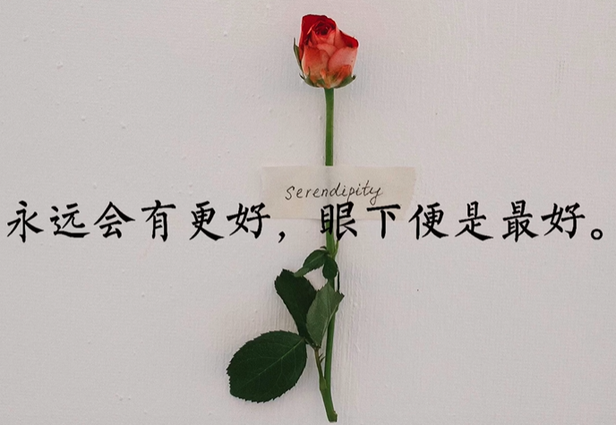

**人生海海，山山而川，不过尔尔。**

**若能避开猛烈的欢喜，自然不会有悲痛来袭。**

**永远会因为温柔而心动。**

**仲夏的黄昏融化了炙热的爱意，**
**春秋的黎明惊扰了神明的温柔。**

**城市慷慨亮了一整夜光，**
**如同少年不惧岁月长。**

**太阳温暖万物享受孤独，**
**月亮却有星星救赎。**

**充满恶臭的玫瑰表达这廉价的爱意。**

**最高级的浪漫，就是柴米油盐。**

**不是只有礼物和花才浪漫，**
**愿意听我碎碎念也很浪漫。**

**遇见你我的心上开成漫山遍野的花。**

**一束花的仪式感永远不会过时。**

**没有销声匿迹，只是在好好生活。**

**我口袋只剩玫瑰一片，可此行山高路远。**

**经历的意义在于引导你而非定义你。**

**自卑溢出来就变成了安静与温柔。**

**喜欢和爱终究是两码事。**

**在无人的角落，会有更浪漫的秘密。**

**再见这个词是期待还是遗憾。**