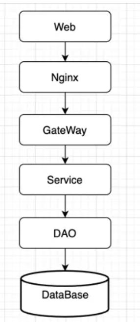

## 概念
幂等这个概念，是一个数学上的概念，即：f……(f(f(x))) = f(x)。用在计算机领域，指的是系统里的接口或方法对外的一种承诺，使用相同参数对同一资源重复调用某个接口或方法的结果与调用一次的结果相同。
## 业务场景
从业务场景上来说，如：现在互联网电商的下单服务，同一个用户在短时间内调用某一个下单服务，只能下单成功一次；银行账户之间的转账，A账户给B账户转账，无论系统出现什么问题或故障，也只能转账成功一次；前端页面对相同表单的内容多次向后端发起提交请求，后端只能给出一个相同的结果等都属于幂等的范畴。
试想一下，如果提供的这些服务不是幂等的，客户在下单时由于网络不稳定或是连续点了几次下单按钮，实际客户只下了一单，结果系统里给客户生成了多单，那平台/商家将是无法承受的，如果被“羊毛党”盯上，损失是无可估量的；银行之间的转账，A账户本来实际给B账户只转了一百万，结果B账户收到了几百万，这在业务上是不可接受的。分析这些业务场景，开发者发现，无论是下单服务、转账服务还是表单提交都是一个个业务请求，提供这些业务服务的接口或方法都应该保证无论服务是超时、重试或有故障等异常情况，都要满足业务上的处理结果是正确的。业务上的一次或多次请求，最终的处理结果是一致的，即：在一定时间内，服务的幂等其实就是请求的幂等。
## 架构分析
从系统架构上进行分析，幂等该在哪一层去做，怎么做？

上图为一个最常见的经典系统框架图，Web端发起一个请求到后端，幂等该在哪一层来处理呢？不妨一层一层的分析。

Nginx是否需要做幂等，Nginx的主要功能是做Web服务器、反向代理、负载均衡等，把请求转发到后端的服务器上，本身不参与具体的业务，所以Nginx是不需要做幂等处理的；Gateway是负责权限校验、安全防御、认证鉴权、流量控制、协议转换、日志审计、监控等，本身也不含对任何业务的处理，所以其也不需要做幂等处理；Service层通常是对业务逻辑进行处理、编排，可能会改变数据，但对于数据的改变结果，最终也还是需要通过数据访问层，写入到数据库，所以Service层也不需要做数据幂等；DAO层主要是和数据库交互，把Service层的结果写入数据库，对Service层提供读取、写入数据库的功能。

在写入数据库的时候，针对每一次的写入，可能返回不同的结果，此时就需要按场景进行具体的分析对待；DataBase层，主要提供数据的存储，并不参与具体的业务逻辑计算。所以，通过对该架构的每一层的功能分析，得出对于请求的幂等处理，需要在DAO层做处理，以便保证多次请求和一次请求的结果是一致的。
## 数据库操作分析
通过上面的分析，得出幂等需要在DAO层来处理，再进一步分析，得出DAO层的操作主要就是CRUD。下面逐一对每一种操作分析是否需要做幂等，以及怎么做。

R（read）：对应的操作SQL语句为select。只要查询条件不变，在一定的时间内，执行一次和执行多次返回的结果肯定是相同的，所以其本身是幂等的，不需要再做处理。

```sql
select * from user where id = 1;
```
查询一次或多次结果是一致的，所以是幂等的。

C（create）：对应的操作SQL语句为insert。此时，需要分情况，如果用到的数据库主键为数据库自增，不考虑业务主键防重的情况下，每一次写入数据库就不是幂等的，所以为了保证幂等，需要在数据insert前做业务防重或是在数据库表上对业务主键加唯一索引。如果数据库主键不是自增，是由业务系统写入的，需要在业务系统里把数据库主键和业务主键做一对一映射，或是由独立服务提供数据库主键和业务主键的映射关系，保证多次请求获取到的数据库主键和业务主键是一致的，确保写入数据库操作是幂等的。综合来说，就是相同的数据多次写入数据库后，能否保证只有一条数据。
```sql
insert into user (id,age,sex,ts) values(1,10,‘male’,2021-07-20 10:22:23);
```
U（update）：对应的操作SQL语句为update。更新操作时，一定是要用绝对值进行更新操作，而不要用相对值进行更新，相对值更新可能导致更新操作不幂等。

幂等：
```sql
update user set age = 10 where id = 1;
```
非幂等：
```sql
update user set age++ where id = 1;
```
D（delete）：对应的操作SQL语句为delete。删除操作时，如果删除的是一个范围，生产上最好是禁止该类操作；比较推荐的做法是把按范围操作删除转换为先按范围查询，再按查询的主键进行删除。而且按范围删除的操作不是幂等的。

幂等：
```sql
delete from user where id = 1;
```
非幂等：该类操作要禁止。
```sql
delete from user where id in （select id from user order by id desc limit 10);
```

## 常见业务场景
保证幂等的实现方式有多种，此处例举几类常见的业务场景，在实际应用中，根据业务场景进行选用。
###  页面token机制
进入页面时，从服务器获取token，在服务器端把token进行存储，提交时把token带到服务器端进行验证,这里的token相当于业务ID
常见的处理流程如下

### 乐观锁机制
使用数据库的版本号实现乐观锁，数据库更新时，判断版本号是否与查询时保持一致，一致更新成功，否则更新失败；

### select+insert
数据写入前，先查询数据是否存在，存在直接返回，不存在则写入数据，保证写入数据库的数据正确性；常用于并发不高的一些后台系统或是防止任务的重复执行；

### 悲观锁机制
一般id为主键或唯一索引，仅锁定当前记录；

```sql
select * from table where  id = '1234' for update;
```

### 去重表
每一次写入或更新业务表时，先查询去重表是否已经存在记录，再操作业务表。

### 数据库唯一索引
为业务表建立唯一索引，避免业务数据多次写入；

### 状态机
务状态在变更之前是有条件的，必须按设定的状态条件进行更新；

在实际开发中，保证提供的接口或服务的幂等（性），是一个最基本的技术要求，希望通过该分析，能对还未理解幂等（性）的研发人员有所帮助。

## 参考资料

- https://mp.weixin.qq.com/s/_Nn5F98PvoWk_xjVrIpFNQ