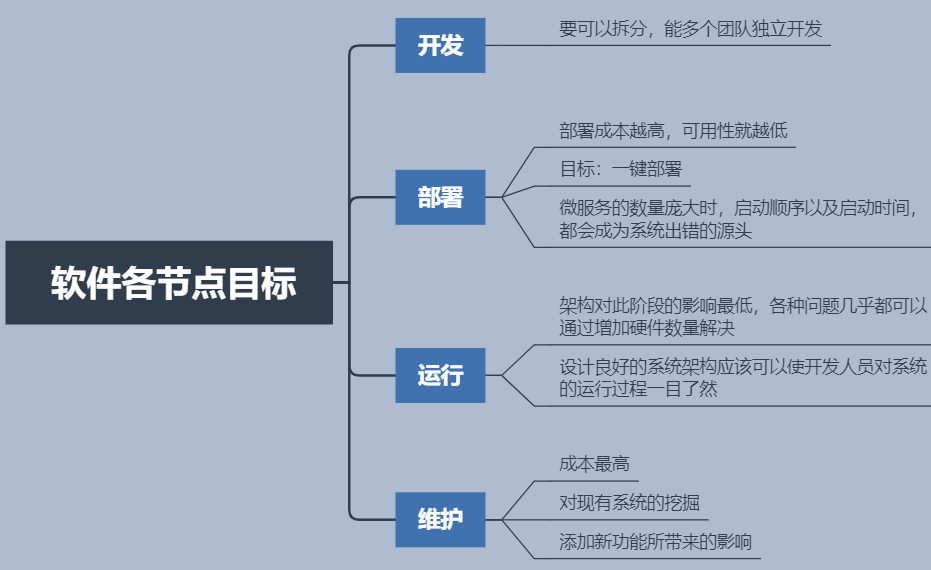

软件架构这项工作的实质就是**规划如何将系统切分成组件，并安排好组件之间的排列关系，以及组件之间互相通信的方式。** (拆分、组合、通信)

## 目标

设计良好的架构可以让系统便于理解、易于修改、方便维护，并且能轻松部署。软件架构的终极目标就是最大化程序员的生产力，同时最小化系统的总运营成本。

## 生命周期

## 设计良好架构的手段

### 始终保持多的可选项

软件架构师的目标是创建一种系统形态，该形态会以策略为最基本的元素，并让细节与策略脱离关系，以允许在具体决策过程中推迟或延迟与细节相关的内容。

1. 不应该过早的关注使用关系型，非关系型，还是分布式数据库
2. 不应该过早的关注使用web服务，或者以某种形式发布（网页，app 等）
3. 不应该确定是否使用 REST模式等
4. 不应该过早的采用依赖注入框架

如果在开发高层策略时有意地让自己摆脱具体细节的纠缠，我们就可以将与具体实现相关的细节决策推迟或延后，因为越到项目的后期，我们就拥有越多的信息来做出合理的决策。

## 组件的层次

### 离io越远，层次越高
我们对“层次”是严格按照“输入与输出之间的距离”来定义的。也就是说，一条策略距离系统的输入/输出越远，它所属的层次就越高。而直接管理输入/输出的策略在系统中的层次是最低的。

